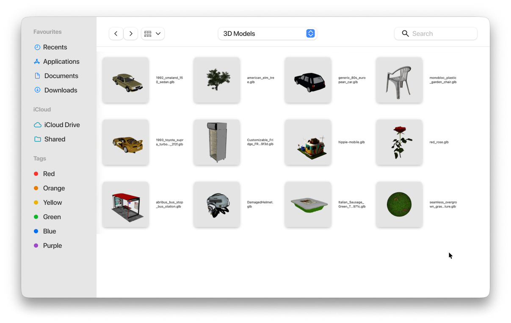
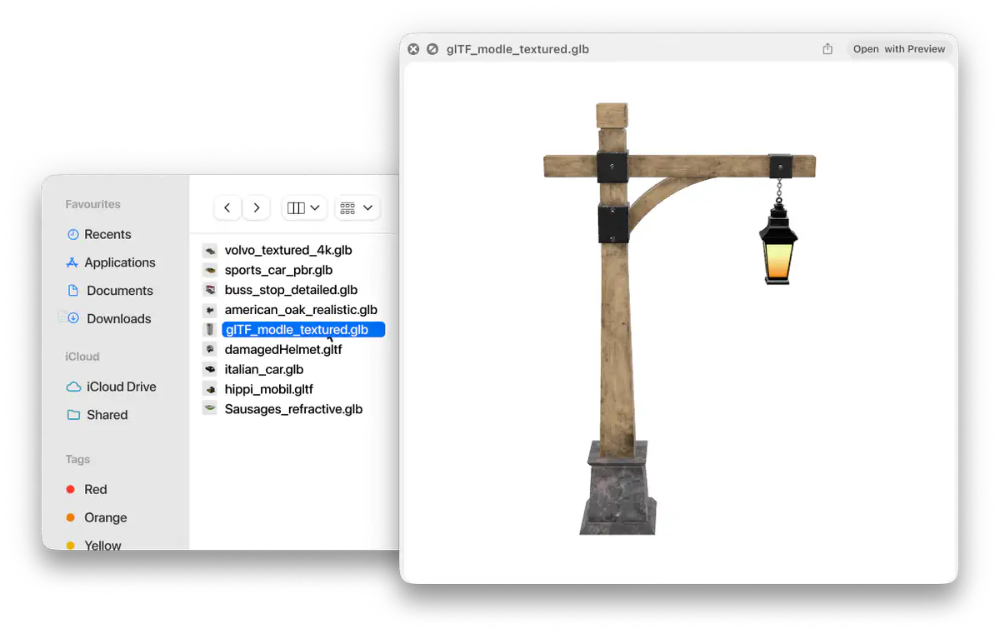
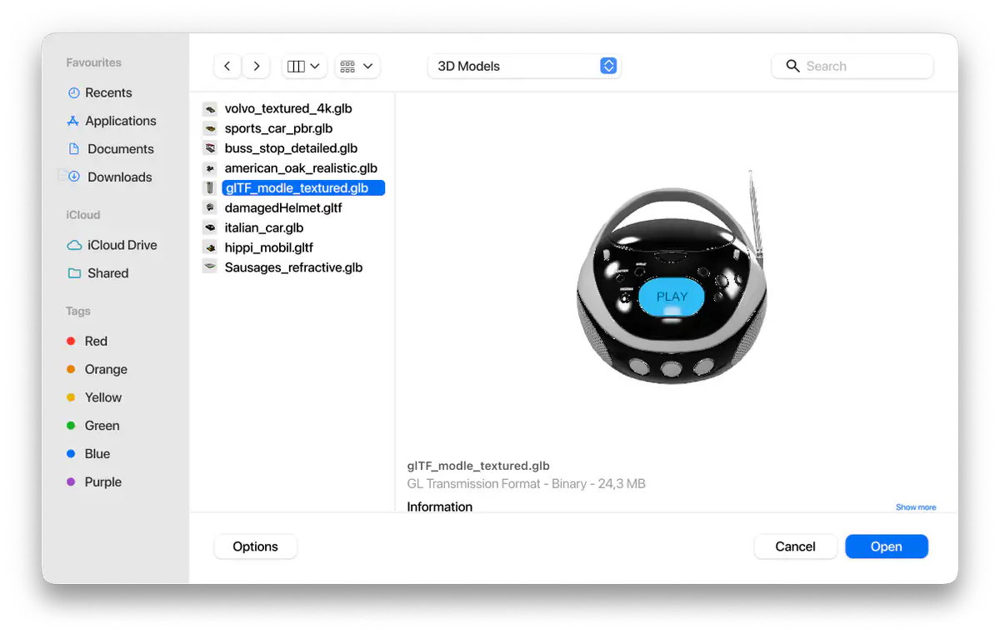
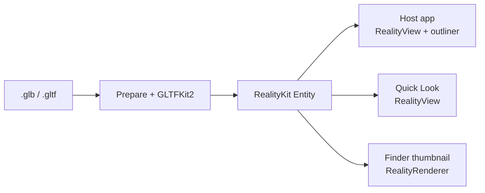

<p align="center">
  
</p>

<h1 align="center">GLB Preview</h1>

<p align="center">
  <strong>Native App and Finder Support for <code>.glb</code> and <code>.gltf</code> Using <a href="https://developer.apple.com/documentation/realitykit">RealityKit</a></strong><br>
  Inspector App, Thumbnails, Quick Look and Preview Pane
</p>

<table>
  <tr>
    <td align="center" valign="top" width="50%">
      
      <small>Viewer App</small>
    </td>
    <td align="center" valign="top" width="50%">
      
      <small>Thumbnails</small>
    </td>
  </tr>
  <tr>
    <td align="center" valign="top" width="50%">
      
      <small>Quick Look</small>
    </td>
    <td align="center" valign="top" width="50%">
      
      <small>Preview Pane</small>
    </td>
  </tr>
</table>


## Install

1. Download [GLBPreview.zip](https://github.com/Hemmingsson/macos-gltf-preview/releases/latest).
2. Move `GLBPreview.app` to `/Applications`.
3. Control-click → **Open** (or allow under **System Settings → Privacy & Security**).
4. Open the app once so the Quick Look preview and thumbnail extensions load.

## Build

Requires Xcode and [XcodeGen](https://github.com/yonaskolb/XcodeGen). Set `DEVELOPMENT_TEAM` in `project.yml`.

1. `brew install xcodegen`
2. `./scripts/build.sh`

This generates the Xcode project, builds, installs to `/Applications`, and checks that the Quick Look extensions registered.

```bash
xcodegen generate
DEVELOPER_DIR=/Applications/Xcode.app/Contents/Developer \
  xcodebuild -scheme GLBPreview -destination 'platform=macOS' \
  -derivedDataPath /tmp/GLBPreview-dd test
```

## How it works

RealityKit does not load glTF by default. The file is prepared, decoded with [GLTFKit2](https://github.com/warrenm/GLTFKit2) (Draco via [DracoSwift](https://github.com/warrenm/DracoSwift)), and converted to a RealityKit `Entity`.



Prepare rewrites materials and meshes RealityKit will not ingest, then the default scene is converted to a physically based entity on a turntable.

App and Quick Look show that entity in a `RealityView` with studio IBL for light and reflections — not a skybox. Finder thumbnails are a still from `RealityRenderer`.

