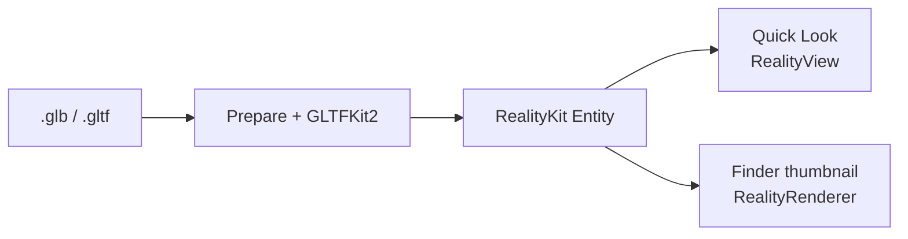

  

# macOS glTF Preview

Quick Look previews and Finder thumbnails for `.glb` and `.gltf` on macOS 15+.

- Drag to orbit, scroll to zoom.
- Play / pause when the file has animations.
- Mesh, material, and animation counts in Quick Look.

  <strong>Finder preview for .glb / .gltf</strong> 
  

<table>
  <tr>
    <td align="center" valign="top" width="50%">
      <strong>Quick Look</strong> 
      
    </td>
    <td align="center" valign="top" width="50%">
      <strong>Finder thumbnails</strong> 
      
    </td>
  </tr>
</table>

## Install

1. Download [GLBPreview.zip](https://github.com/Hemmingsson/macos-gltf-preview/releases/latest).
2. Move `GLBPreview.app` to `/Applications`.
3. Control-click → **Open** (or allow under **System Settings → Privacy & Security**).
4. Open the app once so the Quick Look preview and thumbnail extensions load.

## Build

Requires Xcode, [XcodeGen](https://github.com/yonaskolb/XcodeGen), and [ffmpeg](https://ffmpeg.org). Set `DEVELOPMENT_TEAM` in `project.yml`.

1. `brew install xcodegen ffmpeg`
2. `./scripts/verify.sh --build`

This generates the Xcode project, builds, installs to `/Applications`, and updates the screenshots used in this README (`./scripts/publish.sh`).

## How it works

`.glb` / `.gltf` are loaded with [GLTFKit2](https://github.com/warrenm/GLTFKit2) (Draco via [DracoSwift](https://github.com/warrenm/DracoSwift)). Specular-glossiness materials are converted to metallic-roughness when needed, then the asset becomes a RealityKit `Entity`. The Quick Look preview extension shows it in a `RealityView`; the thumbnail extension draws Finder icons with `RealityRenderer`.

Thanks to [DeepAR's glb-preview](https://github.com/DeepARSDK/glb-preview) for the Quick Look and thumbnail extension layout. That project used SceneKit (deprecated); this app uses RealityKit.
