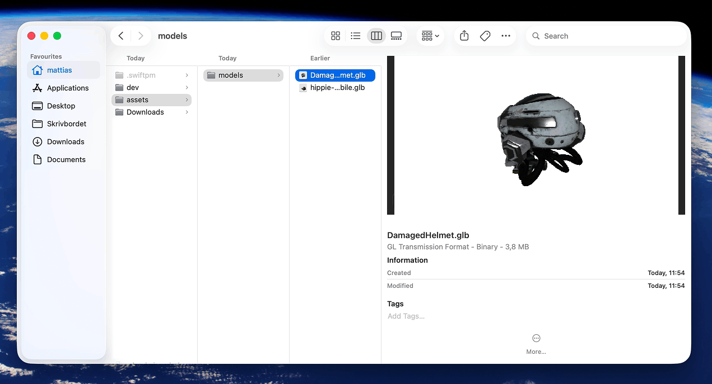
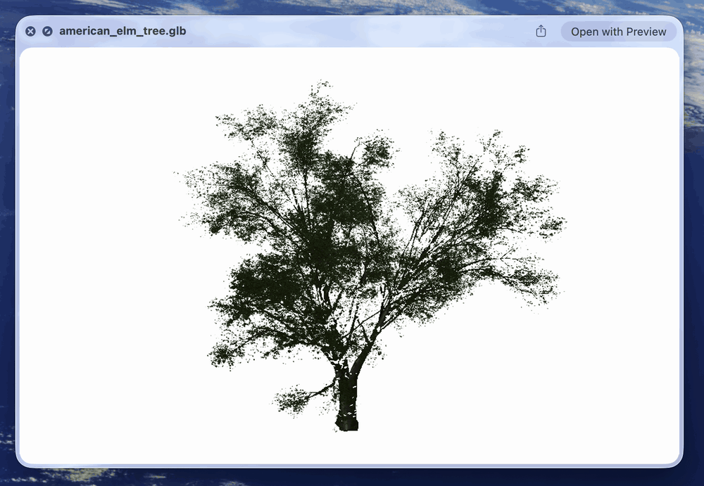
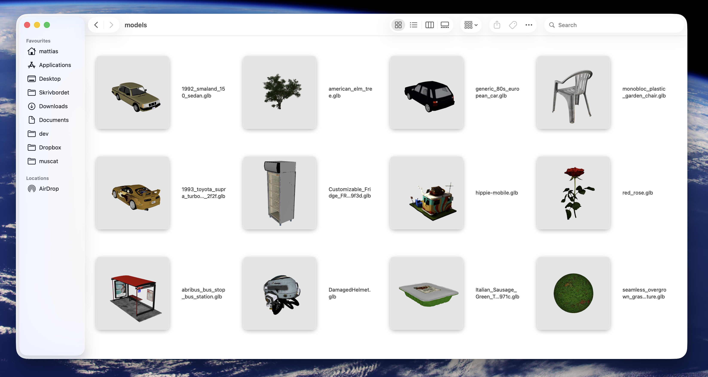

  

# macOS glTF Preview

Spacebar preview / Quick Look and Finder thumbnails for `.glb` / `.gltf`. macOS 15+.

- Drag to orbit, scroll to zoom.
- Play / pause if the file has animations.
- Mesh, material, and animation counts in the viewer.

  <strong>Preview .gltf/.glb files in Finder</strong> 
  

<table>
  <tr>
    <td align="center" valign="top" width="50%">
      <strong>Quick Look</strong> 
      
    </td>
    <td align="center" valign="top" width="50%">
      <strong>Thumbnails</strong> 
      
    </td>
  </tr>
</table>

## Install

1. Download [GLBPreview.zip](https://github.com/Hemmingsson/macos-gltf-preview/releases/latest).
2. Move `GLBPreview.app` to `/Applications`.
3. Right-click → **Open** (or allow in **System Settings → Privacy & Security**).
4. Launch once so the Quick Look plugins register.

## Build

Needs Xcode, [XcodeGen](https://github.com/yonaskolb/XcodeGen), [ffmpeg](https://ffmpeg.org). Set your team ID in `project.yml` (`DEVELOPMENT_TEAM`).

1. `brew install xcodegen ffmpeg`
2. `./scripts/verify.sh --build`

That generates the Xcode project, builds, installs to `/Applications`, and refreshes README assets (`./scripts/publish.sh`).

Started from [DeepAR's glb-preview](https://github.com/DeepARSDK/glb-preview) Quick Look / thumbnail skeleton; rewritten to native RealityKit.
