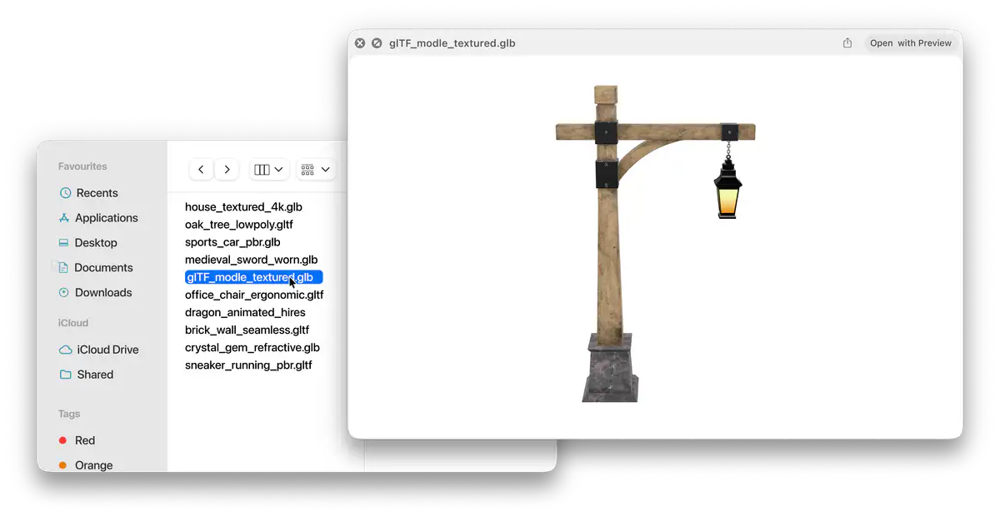
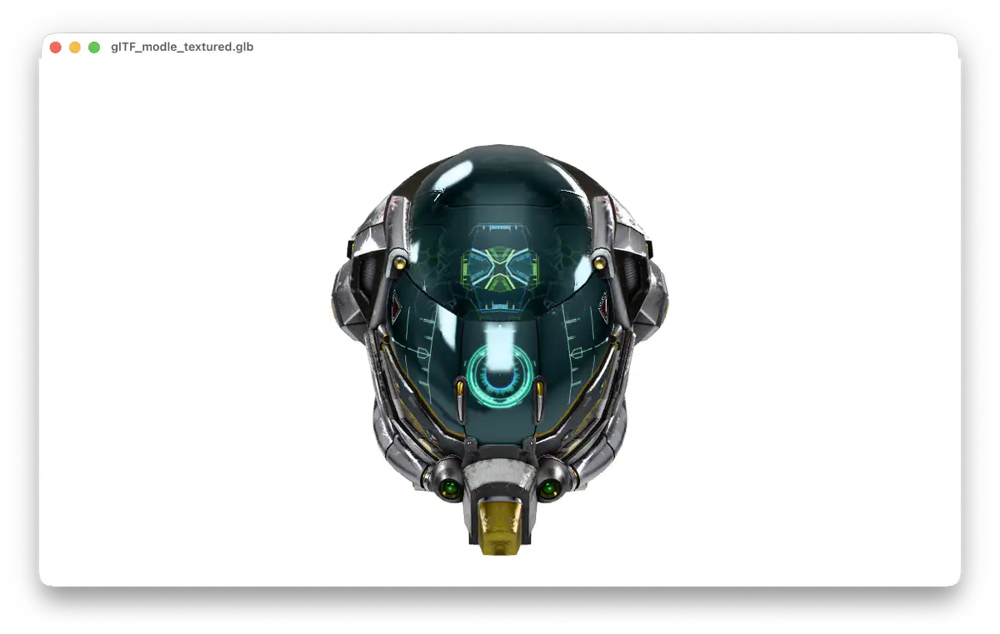
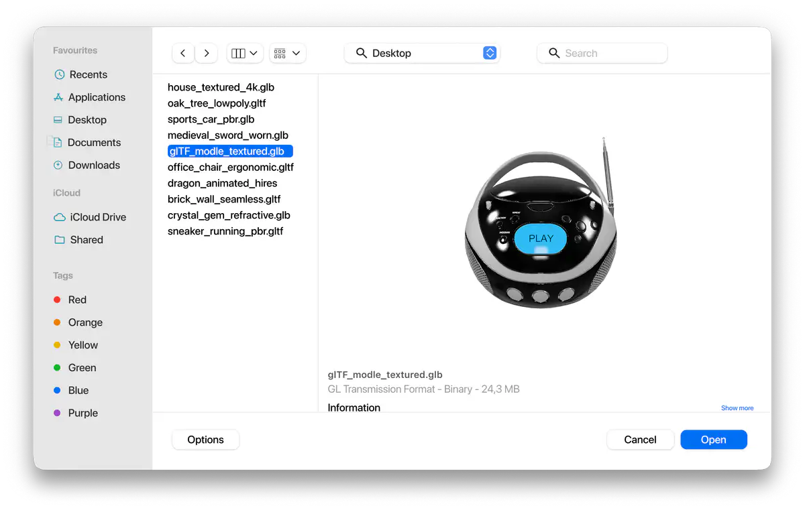
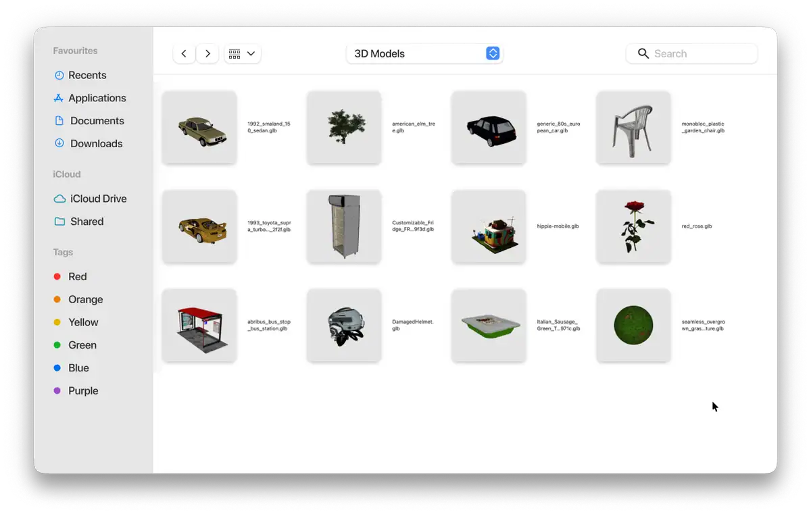
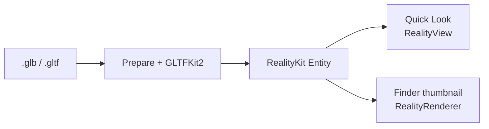

  

# macOS glTF Preview

Quick Look previews and Finder thumbnails for `.glb` and `.gltf` on macOS 15+.

- Finder preview pane for `.glb` / `.gltf`.
- Quick Look (Space) with orbit, zoom, and play / pause for animations.
- Finder icon thumbnails.
- Mesh, material, and animation counts in Quick Look.

  

<table>
  <tr>
    <td align="center" valign="top" width="50%">
      
    </td>
    <td align="center" valign="top" width="50%">
      
    </td>
  </tr>
</table>

  

## Install

1. Download [GLBPreview.zip](https://github.com/Hemmingsson/macos-gltf-preview/releases/latest).
2. Move `GLBPreview.app` to `/Applications`.
3. Control-click → **Open** (or allow under **System Settings → Privacy & Security**).
4. Open the app once so the Quick Look preview and thumbnail extensions load.

## Build

Requires Xcode and [XcodeGen](https://github.com/yonaskolb/XcodeGen). Set `DEVELOPMENT_TEAM` in `project.yml`.

1. `brew install xcodegen`
2. `./scripts/verify.sh --build`

This generates the Xcode project, builds, and installs to `/Applications`.

## How it works

`.glb` / `.gltf` are loaded with [GLTFKit2](https://github.com/warrenm/GLTFKit2) (Draco via [DracoSwift](https://github.com/warrenm/DracoSwift)). Specular-glossiness materials are converted to metallic-roughness when needed, then the asset becomes a RealityKit `Entity`. The Quick Look preview extension shows it in a `RealityView`; the thumbnail extension draws Finder icons with `RealityRenderer`.

Thanks to [DeepAR's glb-preview](https://github.com/DeepARSDK/glb-preview) for the Quick Look and thumbnail extension layout. That project used SceneKit (deprecated); this app uses RealityKit.
