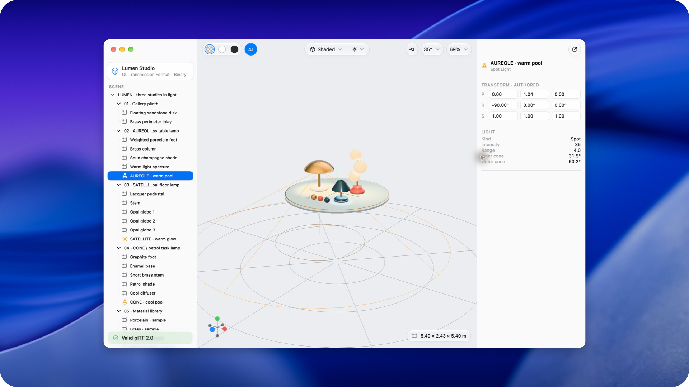

<div align="center">


# glTF Inspector

Open and inspect `.glb` and `.gltf` models on your Mac.
Preview them in Finder with Quick Look and thumbnails.

</div>

<p align="center">
  <br>
  <small>App</small>
</p>

<table>
  <tr>
    <td align="center" valign="top" width="33%">
      <br>
      <small>Thumbnails</small>
    </td>
    <td align="center" valign="top" width="33%">
      <br>
      <small>Quick Look</small>
    </td>
    <td align="center" valign="top" width="33%">
      <br>
      <small>Preview pane</small>
    </td>
  </tr>
</table>

## Install

macOS 26+ on Apple Silicon.

Downloadable builds are not available yet. [Build from source](docs/development.md).

## Use

Open a model in the app, or select one in Finder and press **Space**.
For `.gltf`, keep buffers and textures next to the file.

- Drag to orbit, **Shift-drag** to pan, scroll to zoom
- Select a sidebar row to inspect nodes, meshes, and materials
- Change lighting and view mode, or play an animation
- Export a PNG, or a turntable as MP4 or GIF

[Controls and shortcuts](docs/usage.md)

## Development

```sh
brew install xcodegen
./scripts/dev.sh build
```

Signing and App Group setup come first — see [development](docs/development.md).
Also: [architecture](docs/architecture.md), [design](docs/design.md), [contributing](CONTRIBUTING.md).

## License

[MIT](LICENSE). Third-party notices:
[dependencies](GLTFInspector/Resources/ThirdPartyLicenses),
[lighting images](Renderer/Environments/LICENSES.md).

Screenshots are real app and Finder captures. [How they were made](demo/README.md).
