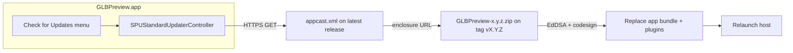

# Sparkle Auto-Updates Design

**Date:** 2026-08-19  
**Status:** Draft for review  
**Out of scope:** Mac App Store, Homebrew Cask (later), custom Sparkle UI, signed feeds (`SURequireSignedFeed`)

## Goal

Users who installed `GLBPreview.app` from GitHub Releases get in-app updates (menu + periodic check) so the host **and** the embedded Quick Look / thumbnail plugins stay current. Distribution stays off the Mac App Store.

## Current state

- Install path: download `GLBPreview.zip` from [Hemmingsson/macos-gltf-preview](https://github.com/Hemmingsson/macos-gltf-preview/releases/latest), copy to `/Applications`, open once.
- `scripts/build.sh` builds **Debug** and copies to `/Applications`. That is a local-dev path, not a release path.
- No CI, no notarize script, no update feed.
- Host app is **not sandboxed**. Extensions are sandboxed. Team `94A9N4B67S`.
- Versions live in `project.yml`: `MARKETING_VERSION` (user-facing) and `CURRENT_PROJECT_VERSION` (Sparkle compare key = `CFBundleVersion`).

## Decision

Use **[Sparkle 2](https://sparkle-project.org/documentation/)** in the **host target only**, via Swift Package Manager, with GitHub Releases as the CDN.

| Choice | Decision |
|---|---|
| Updater | Sparkle 2.9+ (`SPUStandardUpdaterController`, markdown notes) |
| Where it lives | `GLBPreview` only — never link Sparkle into the appexes |
| Archive | Zip containing **only** `GLBPreview.app` (same as today) |
| Feed URL | `https://github.com/Hemmingsson/macos-gltf-preview/releases/latest/download/appcast.xml` |
| Enclosure URLs | Per-tag: `…/releases/download/v{MARKETING_VERSION}/GLBPreview-{MARKETING_VERSION}.zip` |
| Signing | Developer ID + notarize + staple; Sparkle EdDSA on the zip |
| Auto-install | Check automatically; **do not** silent-install (`SUAutomaticallyUpdate` = false) so plugin replacement is user-visible |
| Debug | Do not start the updater (`#if DEBUG`) so local Debug builds never talk to the production feed |
| CI | Local `scripts/release.sh` first; GitHub Actions is a follow-up (certs in secrets) |

## Why not the alternatives

- **Thin GitHub poller:** weaker signing and install story for an app that replaces Finder plugins.
- **GitHub Pages for the zip:** works for the XML; large binaries belong on Releases.
- **MAS:** excluded by product choice; would also force host sandboxing and Apple’s updater.

## Architecture

Sparkle replaces the whole `.app`. Preview and thumbnail extensions update because they are embedded. After relaunch, the user should open the host once (existing install rule) so `pluginkit` sees the new appexes.

## Security

1. **Apple:** Release archives use Developer ID Application, Hardened Runtime, notarization, staple.
2. **Sparkle:** `generate_keys` once. Public EdDSA key in host `Info.plist` as `SUPublicEDKey`. Private key stays in the login Keychain (and a password-manager backup). Never commit the private key.
3. **Transport:** HTTPS GitHub only.
4. **Rotation:** If the EdDSA private key is lost, Sparkle can rotate it on a Developer ID–signed update (do not rotate Apple cert and EdDSA at the same time).

## Versioning

- Tag: `v{MARKETING_VERSION}` (example `v1.2.0`).
- Every release **must** increment `CURRENT_PROJECT_VERSION`. Sparkle ignores marketing version for “is this newer?”.
- Zip name: `GLBPreview-{MARKETING_VERSION}.zip` so historical enclosures stay unique. README “latest” link can still point at `releases/latest` (upload the same zip twice as `GLBPreview.zip` if we want the current README filename to keep working).

## First-release chicken and egg

Builds **without** Sparkle cannot self-update. The first Sparkle-enabled release is the seed. The **next** tagged release is the first automatic update. Manual zip install remains the path for everyone still on the old zip.

## User-visible behavior

- App menu: **Check for Updates…** (disabled while a check/install is running).
- Second launch: Sparkle may ask to check automatically (default Sparkle behavior).
- On update: standard Sparkle dialog, download, replace `/Applications/GLBPreview.app`, relaunch.
- Updates do **not** run if the app is translocated (still in Downloads). README already tells users to move to `/Applications`.

## Release pipeline (local)

1. Bump versions in `project.yml`.
2. `xcodegen` + `xcodebuild archive` (Release, universal `arm64` + `x86_64`).
3. Export Developer ID, notarize, staple.
4. Zip only the `.app`.
5. Copy zip + optional `GLBPreview-{version}.md` notes into `dist/updates/` (gitignored).
6. `generate_appcast` + rewrite enclosure URLs to per-tag GitHub Release URLs.
7. `gh release create vX.Y.Z` with zip, `appcast.xml`, deltas, notes.

`scripts/build.sh` stays Debug → `/Applications` for daily plugin work.

## Testing

- Unit: feed URL, EdDSA public-key shape, Debug-does-not-start-updater flag.
- Script: `release.sh --help`; dry-run version parse from `project.yml`.
- Manual (required): old notarized seed → new notarized build via the real feed, then `scripts/verify.sh` + `qlmanage`.

## Follow-ups (not this project)

- GitHub Actions notarized release (P12 + notary secrets).
- Homebrew Cask that tracks the same GitHub Releases.
- Settings toggle for automatic checks (Sparkle already stores this in defaults).
